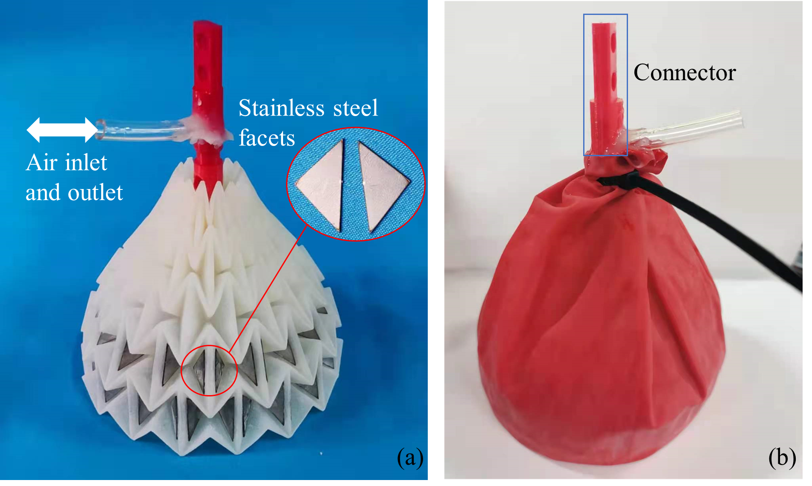
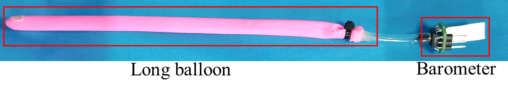
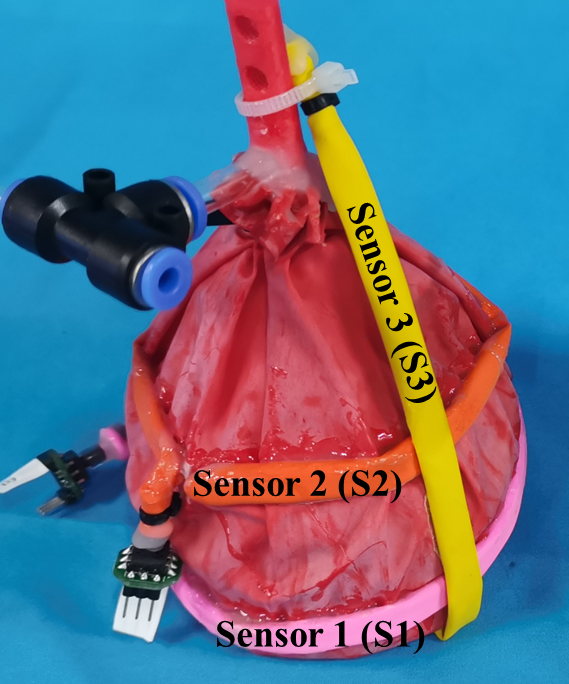

# The Design of a Rigid-Soft Coupled Gripper

Author: Dongbo Liang, **Yinghao Gao**

Fig 1. (a) The inner structure of the rigid-soft coupled gripper  (b) the outer view of the gripper

Fig 2. The composition of a pressure sensor

Fig 3. The layout of pressure sensors

Fig 4. Load capacity comparison between soft gripper and rigid-soft coupled gripper.

Fig 5. A scatter plot of sensor responses to eleven test objects  (black dash lines indicate ± 3 sigma distance)

Each object was grasped for 20 times, and 20 sets of corresponding response are collected. We adopted a supervised learning algorithm KNN (K Nearest Neighbor) to verify the recognition potential of the sensory system. 

Training set: test set = 5 : 15

| Objects             | Accuracy (%) |
| ------------------- | ------------ |
| Cola bottle         | 100          |
| 30mm cube           | 100          |
| 40mm cube           | 100          |
| 50mm cube           | 100          |
| $\Phi$30mm cylinder | 100          |
| $\Phi$40mm cylinder | 100          |
| $\Phi$50mm cylinder | 100          |
| $\Phi$60mm cylinder | 100          |
| Floss box           | 100          |
| Glasses case        | 100          |
| 50mm sponge cube    | 100          |
