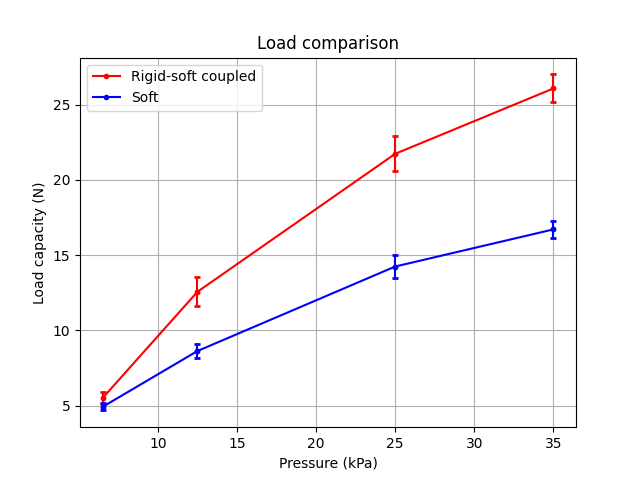
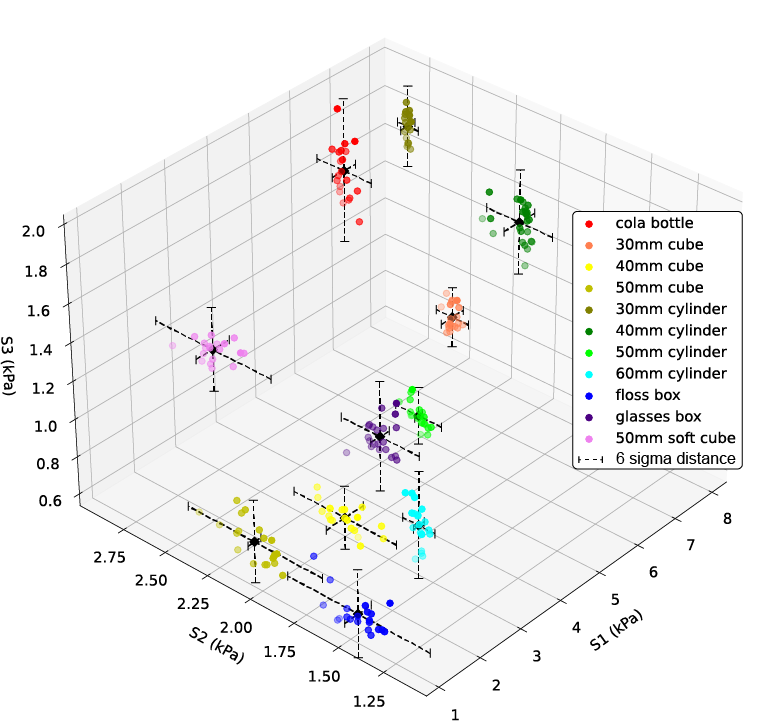

# Rigid-Soft Coupled Gripper

Fig 1. Load capacity comparison between soft gripper and rigid-soft coupled gripper.

Fig 3. The scatter plot of the responses to eleven test  objects (the black dash lines indicate $\pm 3\sigma$ distance)

Each object was grasped for 20 times, and 20 sets of corresponding response are collected. We adopted a supervised learning algorithm KNN (K Nearest Neighbor) to verify the recognition potential of the sensory system. 

Training set: test set = 5 : 15

| Objects             | Accuracy (%) |
| ------------------- | ------------ |
| Cola bottle         | 100          |
| 30mm cube           | 100          |
| 40mm cube           | 100          |
| 50mm cube           | 100          |
| $\Phi$30mm cylinder | 100          |
| $\Phi$40mm cylinder | 100          |
| $\Phi$50mm cylinder | 100          |
| $\Phi$60mm cylinder | 100          |
| Floss box           | 100          |
| Glasses case        | 100          |
| 50mm sponge cube    | 100          |